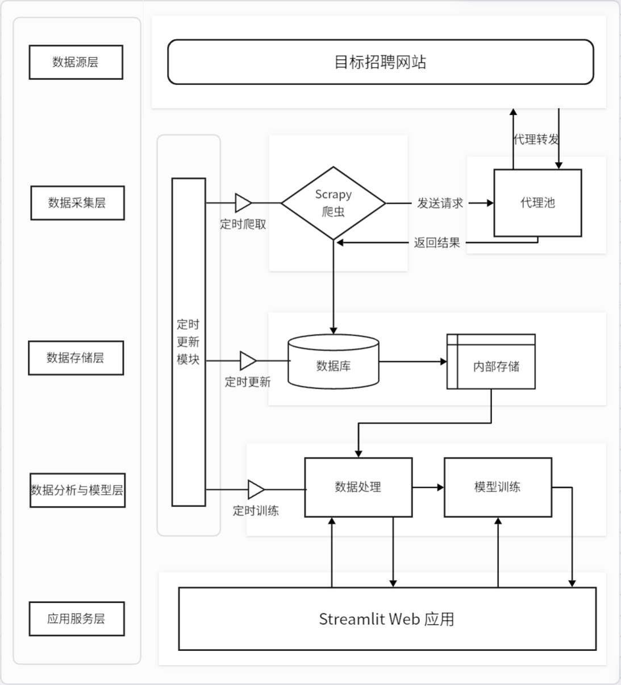
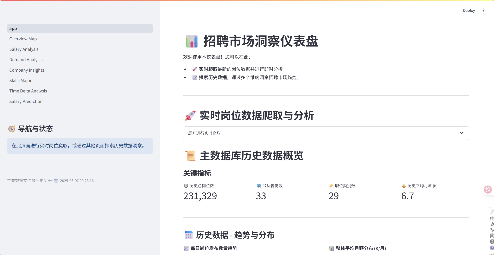
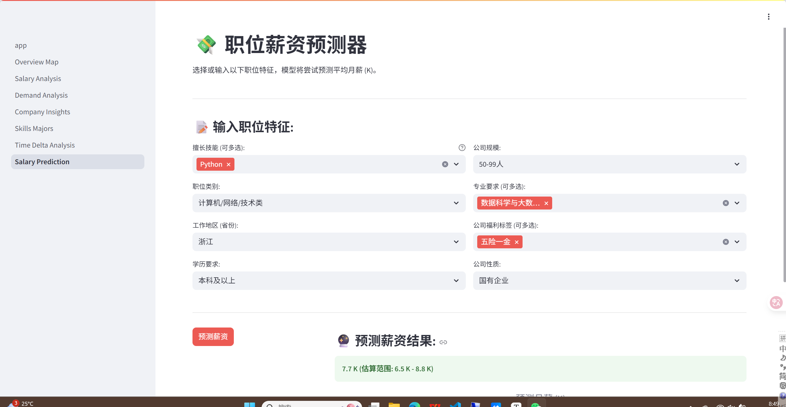

# 📊 招聘市场洞察仪表盘 (Recruitment Market Insights Dashboard)

📊 欢迎来到招聘市场洞察仪表盘！本项目整合**OpenDigger 开源生态数据**与**招聘市场数据**，通过高效采集、深度处理、智能分析与可视化呈现，打造覆盖开发者、企业、教育机构的全场景决策支持工具。平台不仅提供招聘趋势、薪资水平、技能需求等多维度洞察，还支持实时数据爬取、开源技术栈热度分析与基于机器学习的薪资预测功能，为职业规划、技术选型、课程开发提供数据驱动的参考依据。

[](http://10.5.17.156:8501/) 

## 目录

*   [项目架构](#项目架构)
*   [工作原理](#工作原理)
*   [项目目录结构](#项目目录结构)
*   [功能介绍](#功能介绍)
    *   [数据爬取模块 (Crawler)](#数据爬取模块-crawler)
    *   [数据分析与机器学习模块 (Data Analysis)](#数据分析与机器学习模块-data-analysis)
    *   [定时更新模块 (Scheduler)](#定时更新模块-scheduler)
    *   [可视化与交互模块 (Streamlit App)](#可视化与交互模块-streamlit-app)
*   [技术栈](#技术栈)
*   [使用说明](#使用说明)
    *   [先决条件](#先决条件)
    *   [安装](#安装)
    *   [配置](#配置)
    *   [运行步骤](#运行步骤)
        *   [1. 数据库与环境配置](#1-数据库与环境配置)
        *   [2. 数据初始化与首次爬取](#2-数据初始化与首次爬取)
        *   [3. 数据处理与模型训练](#3-数据处理与模型训练)
        *   [4. 启动定时任务 (可选)](#4-启动定时任务-可选)
        *   [5. 启动Streamlit应用](#5-启动streamlit应用)
*   [总结与展望](#总结与展望)
    *   [总结](#总结)
    *   [未来展望](#未来展望)
*   [贡献](#贡献)
*   [许可证](#许可证)

## 项目架构

本项目采用模块化设计，构建 “数据采集 - 处理 - 分析 - 可视化” 完整链路，核心包含五大组件，协同实现开源生态与招聘市场数据的深度融合：

1. **数据采集层**：整合 Scrapy 爬虫与 OpenDigger API，同步抓取招聘平台数据与 GitHub 开源生态数据，覆盖 58 亿 + GitHub 协作日志、3972 万 + 全域仓库数据。
2. **数据存储层**：通过 MySQL 8.0 存储 3972 万仓库数据与招聘结构化数据，搭配 JSON Lines 格式备份，支持 6 小时定时同步与 8 亿 + 网络节点数据管理。
3. **数据分析与机器学习层**：基于 Pandas、Scikit-learn 实现数据清洗、特征工程，训练薪资预测模型；结合 OpenDigger 数据完成开源技术栈热度量化与市场价值交叉验证。
4. **定时更新模块**：通过 APScheduler 实现爬虫调度、数据同步与模型重训练，保障数据时效性与分析准确性。
5. **可视化与交互层**：基于 Streamlit 与 ECharts 构建交互式界面，提供动态词云、多维散点图等可视化组件，支持开源技术趋势与招聘市场数据的联动展示。



## 工作原理

系统以 “开源数据 + 招聘数据” 双驱动，实现全流程自动化处理与洞察呈现：

### 1. 数据采集与融合

- **开源数据采集**：通过 OpenDigger API 获取 GitHub 实时数据，包括技术栈热度、仓库活跃度、开发者协作网络等核心指标。
- **招聘数据采集**：Scrapy 爬虫结合代理池与反反爬策略，从国家大学生就业服务平台等主流渠道抓取职位信息，覆盖薪资、技能要求、公司画像等字段。
- **数据融合**：将 GitHub 热度（开发者关注度）与招聘市场数据（岗位需求量、薪资水平）进行交叉验证，按 5:3:2 权重（开源热度：岗位需求：薪资水平）计算技术栈综合价值。

### 2. 数据处理与存储

- 原始数据经清洗、标准化后，存储于 MySQL 数据库与 JSON Lines 文件，支持 6 小时定时同步与 24/7 持续运行。
- 特征工程模块提取数值特征（薪资分位数）、分类特征（学历 / 公司规模）、文本特征（技能关键词），并生成 combined_text_features 用于模型训练。

### 3. 分析与建模

- 开源技术趋势分析：基于时间序列挖掘技术栈发展轨迹，识别上升期技术方向。
- 薪资预测模型：采用 RandomForestRegressor 等集成算法，基于 23 万 + 条有效数据训练，测试集 R² 达 0.58，MAE 低至 2.1K 元，保障预测准确性。

### 4. 可视化与交互

- Streamlit 应用加载处理后的数据，通过 Plotly Express 与 ECharts 生成动态图表，支持多维度筛选与实时交互。
- 开源技术栈动态词云：字体大小映射热度值，颜色渐变标识薪资水平，悬停展示技术栈详情与趋势变化。



## 项目目录结构

```bash
a-try-of-OR/
├── crawler/                          # 爬虫模块根目录
│   ├── crawler/                      # Scrapy项目核心目录
│   │   ├── data/                     # 存放爬虫选项和原始数据输出
│   │   │   ├── cities.json           # 城市信息 (爬虫使用或生成)
│   │   │   ├── jobs.jsonl            # 主要职位数据存储文件 (JSON Lines格式)
│   │   │   ├── positions.json        # 职位类别信息 (爬虫使用或生成)
│   │   │   └── target_options.json   # Streamlit爬取表单的选项来源 (关键！)
│   │   ├── spiders/                  # Scrapy爬虫定义文件
│   │   │   ├── __init__.py
│   │   │   ├── cities_spider.py      # 爬取城市信息的爬虫
│   │   │   ├── positions_spider.py   # 爬取职位类别的爬虫
│   │   │   └── jobs_spider.py        # 主要的职位信息爬虫
│   │   ├── __init__.py
│   │   ├── items.py                  # Scrapy Item定义
│   │   ├── middlewares.py            # Scrapy中间件 (可集成代理、User-Agent切换等)
│   │   ├── pipelines.py              # Scrapy Pipeline定义 (数据处理与存储到MySQL/JSONL)
│   │   └── settings.py               # Scrapy项目配置文件 (含数据库连接、Pipeline启用等)
│   ├── export_settings_to_json.py    # 用于将Scrapy settings部分配置导出为json的脚本
│   └── scrapy.cfg                    # Scrapy项目部署配置文件
├── data_analysis/                    # 数据分析与机器学习模块
│   ├── models/                       # 存放训练好的模型、预处理器等
│   │   └── salary_model.pkl          # 训练好的薪资预测模型
│   │   └── salary_preprocessor.pkl   # 用于薪资预测的特征预处理器
│   │   └── salary_feature_names.json # 模型使用的特征名
│   └── scripts/                      # 数据处理和模型训练脚本
│       ├── data_processing.py        # 数据清洗、特征工程、预处理器生成
│       └── train_salary_model.py     # 薪资预测模型训练与评估脚本
├── scheduler/                        # 定时任务模块
│   └── update_scheduler.py           # 使用APScheduler等实现定时任务的脚本
│   └── ...                           # (其他可能的配置文件或日志)
├── streamlit_app/                    # Streamlit可视化应用模块
│   ├── assets/                       # 存放静态资源 (停用词、自定义词典、图片、CSS等)
│   │   ├── stopwords.txt
│   │   └── user_dict.txt
│   │   └── style.css                 # 自定义CSS样式
│   ├── pages/                        # Streamlit多页面应用的子页面
│   │   ├── 01_Overview_Map.py        # 概览与地图分析页面
│   │   ├── 02_Salary_Analysis.py     # 薪资深度分析页面
│   │   ├── 03_Demand_Analysis.py     # 市场需求分析页面
│   │   ├── 04_Company_Insights.py    # 企业洞察页面
│   │   ├── 05_Skills_Majors.py       # 技能与专业需求分析页面
│   │   ├── 06_Time_Delta_Analysis.py # 岗位时效性分析页面
│   │   └── 07_Salary_Prediction.py   # 薪资预测服务页面
│   ├── app.py                        # Streamlit应用主入口 (首页)
│   └── utils.py                      # Streamlit应用共享的工具函数和常量 (如数据库连接函数)
├── images/                           # (建议创建) 存放项目README中引用的图片
│   ├── project_architecture.png      # (占位) 项目架构图
│   └── working_principle_flow.png    # (占位) 工作原理流程图
├── .gitignore                        # Git忽略文件配置
├── LICENSE                           # 项目许可证文件
├── README.md                         # 项目说明文件
└── requirements.txt                  # Python项目依赖包列表
```

## 功能介绍

### 数据爬取模块 (Crawler)

-   **核心技术**：Scrapy 框架，利用其异步IO、中间件、Item Pipeline等特性实现高效、可扩展、可复用的网络爬虫。
-   **数据源**：可灵活配置，支持主流招聘网站（具体实现在 `crawler/spiders/` 目录下，如 `jobs_spider.py`）。
-   **爬取内容**：同步抓取招聘平台职位数据与 OpenDigger 开源生态数据，覆盖技术栈热度、岗位需求、薪资水平等核心维度。
-   **参数化配置**：
    *   通过 `crawler/crawler/data/target_options.json` 定义Streamlit应用中实时爬取表单的下拉选项（如城市、职位类别、行业等）及其对应的网站参数代码（`code`）。**此文件是Streamlit与爬虫参数化对接的关键。**
    *   爬虫启动时可通过Scrapy命令行参数（`-a key=value`）传递目标，如特定城市、关键词等，实现灵活定制爬取任务。
-   **反反爬策略**：
    *   在 `middlewares.py` 中配置随机User-Agent、处理Cookies。
    *   支持集成外部代理池服务（需用户自行配置或搭建），在 `settings.py` 中启用相关下载中间件。
-   **数据输出与存储**：
    *   通过 `pipelines.py` 定义数据处理流程。
    *   主要数据持久化到 **MySQL 数据库**，便于后续高效查询和分析。
    *   同时，原始数据以 JSON Lines (`.jsonl`) 格式备份至 `crawler/crawler/data/jobs.jsonl`，方便流式处理和本地快速查阅。

### OpenDigger 开源数据洞察模块

- **技术栈热度分析**：基于 GitHub 实时数据，识别 React、Python、Vue 等技术栈的发展趋势与开发者关注度。
- **开源生态交叉验证**：将 GitHub 热度与招聘市场需求、薪资水平联动，生成技术栈综合价值评分，为学习规划与技术选型提供依据。
- **趋势预测**：通过时间序列分析，预测开源技术栈未来发展轨迹，规避过时技术学习风险。

### 数据分析与机器学习模块 (Data Analysis)

-   **数据处理 (`data_processing.py`)**:
    *   **数据加载**: 从 MySQL 数据库或 `jobs.jsonl` 文件加载原始招聘数据。
    *   **数据清洗**:
        *   处理缺失值（填充、删除）。
        *   转换数据类型（如薪资文本转数值，日期文本转datetime对象）。
        *   去除重复记录、处理异常值。
        *   文本规范化：统一薪资单位（年薪/月薪）、经验年限表述、地点信息等。
    *   **特征工程**:
        *   **数值特征**: 从薪资范围提取最低薪资、最高薪资、平均薪资（通常转换为统一的月薪或年薪）。
        *   **分类特征**: 对学历、公司规模、公司性质等进行编码（如One-Hot Encoding, Label Encoding）。学历可进行有序编码。
        *   **文本特征**:
            *   使用 Jieba 对职位名称、职位描述、技能要求等中文文本进行分词。
            *   结合停用词表 (`streamlit_app/assets/stopwords.txt`) 和用户自定义词典 (`streamlit_app/assets/user_dict.txt`) 提高分词准确性。
            *   提取关键词/技能标签（如使用TF-IDF、Word2Vec或预定义技能列表）。
    *   **产物**: 生成用于模型训练和可视化分析的清洁、结构化的数据集（可能保存为CSV或直接用于下游）。保存必要的特征预处理器（如 `TfidfVectorizer`, `StandardScaler`, `OneHotEncoder` 的实例）到 `data_analysis/models/` 目录（ `salary_preprocessor.pkl`），以便在薪资预测时对新输入数据进行相同的转换。

-   **薪资预测模型训练 (`train_salary_model.py`)**:
    *   **数据准备**: 加载经过预处理的特征数据和目标薪资。
    *   **模型选择**: 支持多种回归模型，如梯度提升回归 (Gradient Boosting Regressor)、随机森林 (Random Forest Regressor)、XGBoost、LightGBM等集成学习模型，因其在结构化数据上的良好表现。
    *   **训练与评估**:
        *   划分训练集和测试集。
        *   进行模型训练，可选进行交叉验证和超参数调优 (如GridSearchCV, RandomizedSearchCV)。
        *   使用 R² 分数 (决定系数)、均方根误差 (RMSE)、平均绝对误差 (MAE) 等指标在测试集上评估模型性能。
    *   **产物**: 将训练好的、性能最佳的薪资预测模型（ `salary_model.pkl`）和模型训练时使用的特征名称列表（ `salary_feature_names.json`，用于确保预测时输入特征的一致性）保存至 `data_analysis/models/`。

### 定时更新模块 (Scheduler)

-   **核心技术**：APScheduler (或同类库，如 `schedule`)，在 `scheduler/update_scheduler.py` 中实现。
-   **主要任务**:
    *   **定期数据采集**：配置定时作业（如每周六凌晨1点）自动执行 Scrapy 爬虫脚本 (`scrapy crawl jobs`)，抓取目标网站上最新的职位信息。
    *   **数据入库/更新**: 爬取到的新数据自动存入 MySQL 数据库，并可选择性更新本地的 `jobs.jsonl` 文件。
    *   **数据处理与模型重训练联动 (可选)**：
        *   在爬虫任务成功完成后，可配置调度器自动触发 `data_analysis/scripts/data_processing.py` 脚本，对新增数据及历史数据进行整合和重新处理。
        *   根据数据更新的频率和模型性能监控结果（例如，若模型预测准确率随时间下降），可配置定期（例如，每周或每月）运行 `data_analysis/scripts/train_salary_model.py` 脚本，使用最新的完整数据集重新训练和部署薪资预测模型。
-   **目标**：实现招聘数据的无人值守、持续更新，保持 MySQL 数据库中数据的时效性，并确保薪资预测模型能反映最新的市场状况，为用户提供准确、及时的市场洞察。

### 可视化与交互模块 (Streamlit App)

作为项目的门户和用户交互界面，Streamlit 应用 (`streamlit_app/`) 提供了直观的数据洞察和实用功能：



-   **首页 (`app.py`)**:
    *   **项目概览与导航**：清晰介绍项目宗旨、核心功能，并提供侧边栏导航至各个分析子页面。
    *   **实时数据爬取表单**：
        *   提供交互式表单，允许用户自定义爬取条件（关键词、城市、行业、经验、学历、公司规模、公司性质等）。这些选项通常来源于 `crawler/crawler/data/target_options.json`。
        *   点击“开始爬取”后，后台通过子进程或线程异步调用Scrapy爬虫模块 (`scrapy crawl jobs -a key=value ...`)。
        *   爬取过程中可显示进度提示。完成后，在页面上即时展示本次爬取的关键统计数据（如获取岗位数、预估平均薪资）和初步的分布图表（如学历分布饼图、职位类别条形图），数据可临时存储或直接写入数据库。
    *   **历史数据概览 (从MySQL加载)**：
        *   展示从 MySQL 数据库中已积累数据的核心指标（总岗位数、覆盖省份/城市数、整体平均薪资等）。
        *   绘制总体趋势图表，如：每日/每周岗位发布量折线图、整体薪资分布直方图/核密度图、热门招聘省份/城市地图或条形图、热门职位类别词云或条形图。
    *   **近期与高薪岗位展示**: 动态展示从数据库中查询到的最新发布的若干职位列表和近期薪资排名前列的职位列表，提供市场最新动态的快速入口。

-   **子页面 (`pages/`)**:
    *   **`01_Overview_Map.py` (概览与地图)**: 利用地理空间数据（如省市经纬度），在地图上（如使用 `st.map` 或 Plotly的地理图表）展示不同城市/省份的岗位数量热力图或平均薪资水平分布。结合关键指标卡片（KPIs），提供宏观市场概览。
    *   **`02_Salary_Analysis.py` (薪资深度分析)**: 多维度剖析薪资水平。用户可通过下拉框选择城市、行业、经验要求、学历水平、公司规模、公司性质等维度，查看对应的平均薪资、中位数薪资、薪资范围（如25%-75%分位数）以及薪资分布（箱线图、小提琴图、直方图）。
    *   **`03_Demand_Analysis.py` (市场需求分析)**: 统计并展示不同城市、行业、职位类别的岗位需求量排名（条形图、排行榜）。通过时间序列图表（折线图）分析特定岗位的需求量随时间的变化趋势。
    *   **`04_Company_Insights.py` (企业洞察)**: 分析发布职位数量最多的热门招聘公司排行。对比不同规模（如初创、成长型、大型）、性质（如国企、外资、民营）公司的招聘偏好（职位类型、技能需求）和薪资待遇水平。从职位描述中提取并展示常见的公司福利标签（如词云、频率列表）。
    *   **`05_Skills_Majors.py` (技能与专业需求)**:
        *   从职位描述和技能要求字段中提取热门技能（通过TF-IDF、关键词匹配等），生成技能词云或按频率排序的条形图。
        *   分析技能之间的共现关系（如热力图、网络图），揭示技能组合需求。
        *   若数据包含专业要求，则展示市场需求量大的专业方向及其对应的平均薪资水平。
    *   **`06_Time_Delta_Analysis.py` (岗位时效性分析)**: 分析岗位的“新鲜度”（从发布日期到当前日期的天数）的分布情况。研究职位信息的更新频率（如果数据包含职位最后更新时间，则分析从发布到最后更新的时间间隔）。探索岗位时效性与薪资水平、招聘数量等因素之间是否存在潜在关联。
    *   **`07_Salary_Prediction.py` (薪资预测服务)**:
        *   提供一个交互式表单，用户输入职位的相关特征（如工作城市、行业、职位名称关键词、工作经验年限、学历要求、核心技能标签等）。
        *   应用加载 `data_analysis/models/` 中保存的特征预处理器 (`salary_preprocessor.pkl`) 对用户输入进行转换，然后使用薪资预测模型 (`salary_model.pkl`) 进行实时预测。
        *   输出预估的薪资范围（如点估计值及可能的置信区间），为求职者和招聘方提供参考。
            

## 技术栈

-   **数据爬取**:
    *   Python 3.9+
    *   **Scrapy**: 高效的异步爬虫框架，支持并发请求、中间件处理（如代理、User-Agent）、Item Pipeline（数据清洗、存储）、可复用Spider组件。
-   **数据处理与分析**:
    *   **Pandas**: 强大的数据处理和分析库，用于DataFrame操作。
    *   **NumPy**: 科学计算基础库，支持多维数组与矩阵运算。
    *   **Jieba**: 中文分词库，用于处理职位描述等文本信息。
-   **机器学习**:
    *   **Scikit-learn**: 综合性的机器学习库，用于特征工程、模型训练（如梯度提升、随机森林）、模型评估。
-   **任务调度**:
    *   **APScheduler** (或 `schedule`): Python定时任务库，用于自动化执行爬虫和数据处理脚本。
-   **Web应用与可视化**:
    *   **Streamlit**: 快速构建数据应用的Python库，提供交互式组件和便捷的部署。
    *   **Plotly Express / Plotly**: 生成高质量交互式图表库。
-   **数据存储**:
    *   **MySQL**: 关系型数据库，用于存储结构化的招聘数据，作为项目的主要数据源。
    *   **JSON Lines (.jsonl)**: 文本文件格式，每行一个JSON对象，用于爬虫原始数据输出和临时存储，便于流式处理。
    *   **Pickle (.pkl)**: Python对象序列化格式，用于保存训练好的机器学习模型和预处理器。
-   **版本控制**: Git

## 使用说明

### 先决条件

-   Python 3.9+
-   pip (Python包管理器)
-   Git (版本控制)
-   MySQL 服务器 (需要预先安装并运行，并创建好相应的数据库和表结构)

### 安装

1. **克隆项目仓库**:

   ```bash
   git clone http://10.132.221.102:8929/weiqianping/pythonfinishwork.git 
   cd pythonfinishwork
   ```

2. **创建并激活Python虚拟环境** (强烈推荐):

   ```bash
   python -m venv .venv
   # Windows:
   .venv\Scripts\activate
   # macOS/Linux:
   source .venv/bin/activate
   ```

3. **安装项目依赖**:

   ```bash
   pip install -r requirements.txt
   ```

   *(确保 `requirements.txt` 文件是最新的，包含了所有必要的库，包括如 `mysql-connector-python` 或 `pymysql` 用于连接MySQL)。*

### 配置

1.  **数据库配置**:
    *   在 `crawler/crawler/settings.py` (针对Scrapy Pipeline) 和 `streamlit_app/utils.py` (或一个专门的 `db_config.py`，针对Streamlit应用) 中配置MySQL数据库的连接信息（主机、端口、用户名、密码、数据库名）。
    *   确保数据库中已根据项目需求创建了相应的表结构。可以提供一个SQL脚本来初始化表。

2.  **Scrapy爬虫配置**:
    *   检查并按需修改 `crawler/crawler/settings.py`，特别是关于请求头 (`DEFAULT_REQUEST_HEADERS`)、下载延迟 (`DOWNLOAD_DELAY`)、并发数 (`CONCURRENT_REQUESTS_PER_DOMAIN`)、启用的Pipeline (确保MySQL Pipeline和JSONL Pipeline已配置并启用)。
    *   **关键**: 核对 `crawler/crawler/data/target_options.json` 文件。此文件定义了Streamlit应用中实时爬取表单的下拉选项（如城市、职位类别、行业等）及其对应的 `code` 值。这些 `code` 值**必须**与您的Scrapy爬虫在构造请求URL时能识别的参数相匹配。如果您的爬虫依赖特定的参数名或值，请确保此JSON文件内容正确。
    *   如果使用代理池，请在 `settings.py` 中配置代理中间件的相关参数。

3.  **Jieba分词 (如果使用)**:
    *   自定义词典和停用词表已放置在 `streamlit_app/assets/` 目录下。如果路径有变，请在 `streamlit_app/utils.py` 或相关数据处理脚本中更新对应的文件路径常量 (如 `USER_DICT_FILE`, `STOPWORDS_FILE`)。

### 运行步骤

#### 1. 数据库与环境配置

*   确保MySQL服务正在运行。
*   根据 `配置`部分的说明，完成数据库连接信息和Scrapy爬虫的配置。
*   如果提供了数据库初始化脚本 (e.g., `schema.sql`)，请先执行它来创建必要的表。

#### 2. 数据初始化与首次爬取

如果您是首次运行项目，或者数据库为空，您需要先运行爬虫来获取基础数据。

* 导航到Scrapy项目目录:

  ```bash
  cd crawler
  ```

* 执行主要的职位爬虫 (假设爬虫名为 `jobs`):

  ```bash
  scrapy crawl jobs
  ```

  此命令会将爬取的数据通过Pipeline存入MySQL数据库，并同时输出到 `settings.py` 中 `FEEDS` 配置指定的文件（通常是 `crawler/crawler/data/jobs.jsonl`）。
  您也可以通过命令行参数传递特定参数给爬虫，例如指定爬取城市（假设爬虫支持 `target_cities_json` 参数）：

  ```bash
  scrapy crawl jobs -a target_cities_json='[{"name":"北京市", "code":"110000"}]'
  ```

  *(确保传递的参数名和格式与您的爬虫 `jobs_spider.py` 中的定义一致)*

#### 3. 数据处理与模型训练

在获得足够的原始职位数据 (存储于MySQL) 后，进行数据处理和模型训练。

* **数据预处理**:
  从项目根目录 (`pythonfinishwork/`) 执行：

  ```bash
  python data_analysis/scripts/data_processing.py
  ```

  此脚本会从MySQL读取原始数据，进行清洗和特征工程，并将处理后的数据（或其元信息）以及特征预处理器保存到 `data_analysis/models/` 目录。

* **薪资预测模型训练**:
  从项目根目录执行：

  ```bash
  python data_analysis/scripts/train_salary_model.py
  ```

  此脚本会加载预处理数据，训练薪资预测模型，并将训练好的模型文件保存到 `data_analysis/models/`。

#### 4. 启动定时任务 (可选)

如果您希望数据能自动定期更新：

* 根据您的需求配置 `scheduler/update_scheduler.py` 中的定时作业（例如，爬取频率、是否自动触发数据处理和模型重训练）。确保脚本中调用Scrapy爬虫的命令正确。

* 从项目根目录启动调度器：

  ```bash
  python scheduler/update_scheduler.py
  ```

  调度器将在后台运行，并按计划执行任务，更新MySQL数据库中的数据。

#### 5. 启动Streamlit应用

* 确保您当前位于项目根目录 (`pythonfinishwork/`)。

* 运行Streamlit应用：

  ```bash
  streamlit run streamlit_app/app.py
  ```

* 应用通常会自动在您的默认浏览器中打开。如果没有，请手动访问 `http://localhost:8501`（或您配置的IP和端口，如 `http://10.5.17.156:8501/`）。

* 现在您可以通过Streamlit界面进行交互式数据探索、触发实时爬取（如果需要）和使用薪资预测功能了。

## 总结与展望

### 总结

本项目成功地整合了Web爬虫（Scrapy）、数据存储（MySQL, JSON Lines）、数据处理与机器学习（Pandas, Scikit-learn）、任务调度（APScheduler）和交互式数据可视化（Streamlit, Plotly Express）技术，构建了一个功能较为全面的招聘市场洞察仪表盘。通过该平台，用户不仅能够深入探索历史招聘数据的多维度趋势（如薪资结构、技能需求热点、地域分布差异等），还能够利用实时爬取功能获取最新的市场动态，并通过集成的薪资预测模型为个人职业规划或企业薪酬策略提供数据参考。项目的模块化设计和清晰的工作流程为后续的功能扩展和维护奠定了良好基础。

### 未来展望

为进一步提升本项目的实用性和智能化水平，未来可以从以下几个方向进行深化和拓展：

1.  **用户模块与个性化服务**:
    *   **用户账户系统**：引入用户注册、登录与个人配置管理功能。
    *   **岗位期望跟踪**：允许用户记录和管理自己的求职偏好（期望城市、行业、职位类型、薪资范围、关注技能等）。
    *   **智能岗位推荐**：基于用户的历史行为、求职期望以及协同过滤或内容匹配算法，实现个性化的职位推送服务。
    *   **订阅与实时通知**：当出现符合用户预设条件的新岗位时，通过邮件、微信（需集成API）或应用内消息等方式主动通知用户。
2.  **实时爬虫功能与数据源增强**:
    *   **多数据源集成**：扩展爬虫框架，支持同时或选择性地从更多主流招聘网站（如BOSS直聘、拉勾、猎聘等）抓取数据，以增强数据的全面性和代表性。
    *   **智能化增量爬取**：优化爬取策略，实现更精准的增量数据识别与获取（如基于职位发布时间或ID），减少冗余数据下载，提高更新效率和资源利用率。
    *   **高级反爬虫策略**：持续优化代理池管理和IP轮换机制，研究并集成更复杂的User-Agent轮换、验证码自动识别（谨慎使用，遵守法律法规）、以及对JavaScript动态加载内容的处理能力（如使用Selenium或Playwright与Scrapy结合），以应对更严峻的反爬措施。
    *   **爬取任务可视化管理**：在Streamlit界面中提供更完善的爬取任务监控面板，允许用户查看任务运行状态、历史记录、日志摘要，并能手动触发、暂停或停止特定爬取任务。
3.  **数据分析与模型能力深化**:
    *   **高级NLP应用**：利用更先进的自然语言处理技术（如BERT、Transformer模型）对职位描述、任职要求等文本数据进行深度语义分析，提取更细粒度的技能标签、软技能需求、企业文化特征等。
    *   **职业发展路径分析**：基于大量数据，分析不同职位间的常见晋升路径和技能迁移模式。
    *   **市场供需匹配度分析**：结合人才库数据（若可得）与招聘需求数据，分析特定区域或行业的人才供需平衡状况。
    *   **模型可解释性增强**：为薪资预测等机器学习模型引入可解释性分析工具（如SHAP、LIME），帮助用户理解模型决策依据。
4.  **用户体验与平台性能优化**:
    *   **交互式报表与自定义分析**：允许用户在前端自定义图表维度、筛选条件，甚至拖拽生成简单的分析报表。
    *   **性能优化**:
        *   针对大规模数据集的加载、处理和可视化渲染进行性能调优，如对MySQL查询进行优化（索引、分页加载）。
        *   采用更高效的数据传输和缓存机制。
        *   后端计算：对于复杂分析，将计算任务放在后端处理，Streamlit仅负责展示结果。
    *   **移动端适配**：优化Streamlit应用的响应式布局，提升在移动设备上的用户体验。
    *   **API接口服务**: 将核心分析功能（如薪资预测）封装成API，供其他系统调用。

通过持续迭代和功能完善，期望本项目能发展成为一个更加智能、个性化、且对用户极具价值的招聘市场分析与决策支持平台。

## 贡献

欢迎对此项目感兴趣的开发者参与贡献！您可以通过以下方式：

*   报告Bug或提出功能建议：请通过 GitHub Issues 提交。
*   贡献代码：请 Fork 本仓库，创建您的特性分支 (`git checkout -b feature/YourFeatureName`)，完成修改后提交 Pull Request (`git push origin feature/YourFeatureName`)，并详细描述您的更改。

## 许可证

本项目采用 [MIT许可证](LICENSE.txt) 